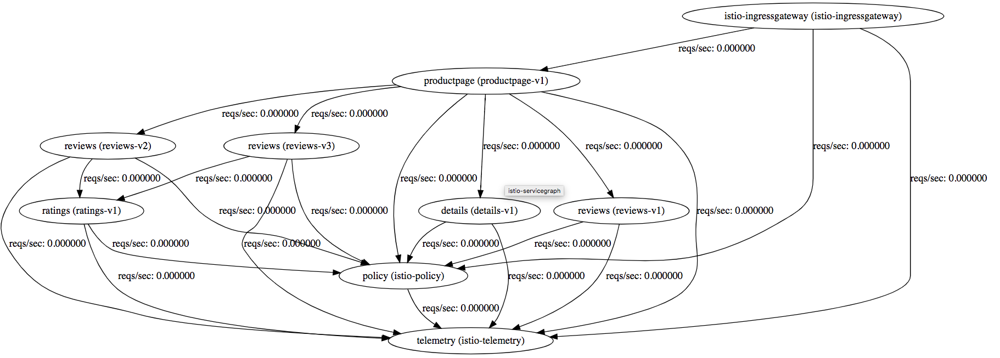

# Kubernetes / Istio

This demo will lead your through the process of setting up Kubernetes and Istio on a local machine/laptop. It will showcase the Istio control plane functionality and the reporting features it comes with. **Currently the instructions are geared toward setup on a Mac with OS X installed.**

# Prerequisite Installations

You will need to install Minikube, a utility that lets you run a Kubernetes cluster locally.

    brew cask install minikube

Now install `kubectl`, the CLI for Kubernetes.

    brew install kubernetes-cli

**Optional**: Minikube requires a hypervisor to manage the cluster VM. By default, it will use the docker system which may require more resources and slow performance by a little. Alternately, you can install a hypervisor yourself such as VMWare Fusion, HyperKit or VirtualBox.

**Note**: As of this writing here are the current versions

    $ minikube version
    minikube version: v0.30.0
    $ kubectl version
    Client Version: version.Info{Major:"1", Minor:"12", GitVersion:"v1.12.2", GitCommit:"17c77c7898218073f14c8d573582e8d2313dc740", GitTreeState:"clean", BuildDate:"2018-10-30T21:39:38Z", GoVersion:"go1.11.1", Compiler:"gc", Platform:"darwin/amd64"}
    Server Version: version.Info{Major:"1", Minor:"10", GitVersion:"v1.10.0", GitCommit:"fc32d2f3698e36b93322a3465f63a14e9f0eaead", GitTreeState:"clean", BuildDate:"2018-03-26T16:44:10Z", GoVersion:"go1.9.3", Compiler:"gc", Platform:"linux/amd64"}

*Before proceeding ensure you have the at least the versions listed here. Previous versions will most likely not work in this demo.*

# Test Minikube

To start the Kubernetes cluster using docker as hypervisor

    minikube start

Alternately, if you installed a hypervisor you can supply the driver name

    minikube start --vm-driver=vmwarefusion

By starting Minikube, the process will automatically configure the kubectl command to target the running Kubernetes cluster. This should be reflected in the output.

Now, we will tell Kubernetes to deploy a simple hello world app and expose the app externally

    kubectl run hello-minikube --image=k8s.gcr.io/echoserver:1.4 --port=8080
    kubectl expose deployment hello-minikube --type=NodePort

Using this command you can see the status of all pods in the default namespace, wait until the pod's status becomes "Running"

    kubectl get pod

Now we can test the hello world app by sending it a request

    curl $(minikube service hello-minikube --url)

This request should return a 200 status along with some sample output.

Optionally, if you are interested to see the Kubernetes dashboard and the different elements of the UI you may run this

    minikube dashboard

This command should start the dashboard process in the cluster and automatically open a browser window with the UI. Here is a sample of the dashboard (image depicts Book Info app already deployed, which comes later in this demo)

To clean up the hello wold app after you are done testing

    kubectl delete service hello-minikube
    kubectl delete deployment hello-minikube

Finally, you may stop the cluster with the following command

    minikube stop

# Install Istio

In order to install Istio we must have the cluster running. If you left minikube running from the previous step, it is best to stop it now and restart it with this command

    minikube start --memory=8192 --cpus=4 --kubernetes-version=v1.10.0

Optionally, supply the hypervisor driver with the —vm-driver option.

Note: Istio resources take a bit of memory, which is why we need the —memory option. 8GB is considered the minimum for this demo, but more would be ideal if you want to raise it.

Run the following command to see the status of all pods as they come up. Wait for all pods to be in the "Running" state

    kubectl get pods --all-namespaces

Next, download the Istio distribution

    curl -L https://git.io/getLatestIstio | sh -

This should create a new folder in the current directory called `istio-1.0.3`.

Note: For the remainder of this demo, this new folder should be your current working directory. If you change cwd, then adjust the command lines to compensate for the location of Istio configs.

You might want to add the Istio `bin` folder to your PATH at this time. If you have done this correctly, you will see the output to the following command

    $ istioctl version
    Version: 1.0.3
    GitRevision: a44d4c8bcb427db16ca4a439adfbd8d9361b8ed3
    User: root@0ead81bba27d
    Hub: docker.io/istio
    GolangVersion: go1.10.4
    BuildStatus: Clean

Istio requires some custom resource definitions, run the following

    kubectl apply -f install/kubernetes/helm/istio/templates/crds.yaml

Now, we will install all of the Istio core components. For the sake of this demo, we will be using a script that also includes some support service such as Prometheus and Grafana.

    kubectl apply -f install/kubernetes/istio-demo.yaml

Now we may take a look at the list of services that were installed

    kubectl get svc -n istio-system

You should see a list of services similar to this

    istio-citadel            ClusterIP      10.110.193.191   <none>        8060/TCP,9093/TCP                                                                                                         7d
    istio-egressgateway      ClusterIP      10.101.128.144   <none>        80/TCP,443/TCP                                                                                                            7d
    istio-galley             ClusterIP      10.100.243.209   <none>        443/TCP,9093/TCP                                                                                                          7d
    istio-ingressgateway     LoadBalancer   10.99.194.132    <pending>     80:31380/TCP,443:31390/TCP,31400:31400/TCP,15011:31688/TCP,8060:32702/TCP,853:30163/TCP,15030:30103/TCP,15031:32448/TCP   7d
    istio-pilot              ClusterIP      10.102.142.211   <none>        15010/TCP,15011/TCP,8080/TCP,9093/TCP                                                                                     7d
    istio-policy             ClusterIP      10.98.140.62     <none>        9091/TCP,15004/TCP,9093/TCP                                                                                               7d
    istio-sidecar-injector   ClusterIP      10.101.126.23    <none>        443/TCP                                                                                                                   7d
    istio-telemetry          ClusterIP      10.97.82.1       <none>        9091/TCP,15004/TCP,9093/TCP,42422/TCP                                                                                     7d

**Note**: Since we are using minikube, the external IP of `istio-ingressgateway` will always be `<pending>` since we do not have a real load balancer to act as ingress. We can simply use NodePort to expose our services externally.

Now monitor the pods status and wait for all services to be in "Running" or "Completed" state

    kubectl get pods -n istio-system

Note: If the pods continually show "Error" or "CrashLoopBackoff" state, just wait a few minutes more. If this problem persists, then you likely have not given minikube enough memory on startup. To fix this, stop minikube and restart with the correct memory options (see above).

# Deploy the Book Info services

Istio comes with a sample Book Info services that is comprised of a distributed web application. It showcases a small service mesh made up of a product page (web app), a details service, a review service and a ratings service. All of these backing services play a part in serving a web page that shows a sample book review website. We will use this mesh to demonstrate examples of the various features of Istio.

First, we will tell Kubernetes to automatically inject the Istio sidecar with all services by default. This can be easily done manually as well, but auto injection is much more simplified for this demo

    kubectl label namespace default istio-injection=enabled

Deploy the Book Info services and create pods

    kubectl apply -f samples/bookinfo/platform/kube/bookinfo.yaml

Ensure all services are installed and all pods are running

    $ kubectl get svc
    NAME          TYPE        CLUSTER-IP       EXTERNAL-IP   PORT(S)    AGE
    details       ClusterIP   10.110.120.218   <none>        9080/TCP   7d
    kubernetes    ClusterIP   10.96.0.1        <none>        443/TCP    7d
    productpage   ClusterIP   10.103.10.13     <none>        9080/TCP   7d
    ratings       ClusterIP   10.111.45.96     <none>        9080/TCP   7d
    reviews       ClusterIP   10.97.113.115    <none>        9080/TCP   7d
    $ kubectl get pods
    NAME                           READY   STATUS    RESTARTS   AGE
    details-v1-6865b9b99d-qhs4j    2/2     Running   0          7d
    productpage-v1-f8c8fb8-hllvd   2/2     Running   0          7d
    ratings-v1-77f657f55d-fp6w8    2/2     Running   0          7d
    reviews-v1-6b7f6db5c5-swhrv    2/2     Running   0          7d
    reviews-v2-7ff5966b99-48khn    2/2     Running   0          7d
    reviews-v3-5df889bcff-28wv6    2/2     Running   0          7d

Notice there are two copies of each service running.

In order to access the main service, we must install a gateway

    kubectl apply -f samples/bookinfo/networking/bookinfo-gateway.yaml

and verify the gateway exists

    $ kubectl get gateway
    NAME               CREATED AT
    bookinfo-gateway   7d

Now create some environment variables to store the local location information for convenience

    export INGRESS_PORT=$(kubectl -n istio-system get service istio-ingressgateway -o jsonpath='{.spec.ports[?(@.name=="http2")].nodePort}')
    export SECURE_INGRESS_PORT=$(kubectl -n istio-system get service istio-ingressgateway -o jsonpath='{.spec.ports[?(@.name=="https")].nodePort}')
    export INGRESS_HOST=$(minikube ip)
    export GATEWAY_URL=$INGRESS_HOST:$INGRESS_PORT

Now we may send a query to the Book Info service to test response

    curl -o /dev/null -s -w "%{http_code}\n" http://${GATEWAY_URL}/productpage

Optionally, you may also view this in a browser

    open http://${GATEWAY_URL}/productpage

You should see a web page that shows the following

Now, let's take a look at the Book Reviews part of the page. Notice in the above picture there are no stars below each review. The review service is responsible for rending this part of the page. If you look back above you will notice we have three different versions of the review service running

    reviews-v1-6b7f6db5c5-swhrv    2/2     Running   0          7d
    reviews-v2-7ff5966b99-48khn    2/2     Running   0          7d
    reviews-v3-5df889bcff-28wv6    2/2     Running   0          7d

Each of these services renders slightly differently. If you refresh the browser a few times you will notice a different rendering of the review services, depending on which service instance is invoked.

This demonstrates the ability to run many different versions of the same services. Further below we will demonstrate using Istio to control exactly how much traffic is routed to these different versions of the reviews service. But, before that let's set the foundation we will need in order to conduct intelligent routing.

Run this command to setup the default destination rules for the services

    kubectl apply -f samples/bookinfo/networking/destination-rule-all.yaml

Wait for a moment to allow the ruleset to propagate and then check the rules

    kubectl get destinationrules -o yaml

# *The sections that follow can be run in any order depending on the Istio feature you want to demonstrate. If there are section dependencies they will be noted.*

# Istio Health, Telemetry Tracking and Tracing

Istio provides powerful observability into its own performance as well as the ability to monitor service call telemetry. We will use Prometheus, Grafana and Jaeger to visualize this information.

First let's setup some rules for logging to prometheus. Create a new file called `new_telemetry.yaml` and enter the the following data into the file

    # Configuration for metric instances
    apiVersion: "config.istio.io/v1alpha2"
    kind: metric
    metadata:
      name: doublerequestcount
      namespace: istio-system
    spec:
      value: "2" # count each request twice
      dimensions:
        reporter: conditional((context.reporter.kind | "inbound") == "outbound", "client", "server")
        source: source.workload.name | "unknown"
        destination: destination.workload.name | "unknown"
        message: '"twice the fun!"'
      monitored_resource_type: '"UNSPECIFIED"'
    ---
    # Configuration for a Prometheus handler
    apiVersion: "config.istio.io/v1alpha2"
    kind: prometheus
    metadata:
      name: doublehandler
      namespace: istio-system
    spec:
      metrics:
      - name: double_request_count # Prometheus metric name
        instance_name: doublerequestcount.metric.istio-system # Mixer instance name (fully-qualified)
        kind: COUNTER
        label_names:
        - reporter
        - source
        - destination
        - message
    ---
    # Rule to send metric instances to a Prometheus handler
    apiVersion: "config.istio.io/v1alpha2"
    kind: rule
    metadata:
      name: doubleprom
      namespace: istio-system
    spec:
      actions:
      - handler: doublehandler.prometheus
        instances:
        - doublerequestcount.metric
    ---
    # Configuration for logentry instances
    apiVersion: "config.istio.io/v1alpha2"
    kind: logentry
    metadata:
      name: newlog
      namespace: istio-system
    spec:
      severity: '"warning"'
      timestamp: request.time
      variables:
        source: source.labels["app"] | source.workload.name | "unknown"
        user: source.user | "unknown"
        destination: destination.labels["app"] | destination.workload.name | "unknown"
        responseCode: response.code | 0
        responseSize: response.size | 0
        latency: response.duration | "0ms"
      monitored_resource_type: '"UNSPECIFIED"'
    ---
    # Configuration for a stdio handler
    apiVersion: "config.istio.io/v1alpha2"
    kind: stdio
    metadata:
      name: newhandler
      namespace: istio-system
    spec:
     severity_levels:
       warning: 1 # Params.Level.WARNING
     outputAsJson: true
    ---
    # Rule to send logentry instances to a stdio handler
    apiVersion: "config.istio.io/v1alpha2"
    kind: rule
    metadata:
      name: newlogstdio
      namespace: istio-system
    spec:
      match: "true" # match for all requests
      actions:
       - handler: newhandler.stdio
         instances:
         - newlog.logentry
    ---
    

Now apply the logging rules

    kubectl apply -f new_telemetry.yaml

Generate some data to be logged by hitting the productpage endpoint a few times

    curl http://$GATEWAY_URL/productpage

or, you could just refresh the browser several times.

Now we must add a port forwarding rule so we can reach the Prometheus dashboard

    kubectl -n istio-system port-forward $(kubectl -n istio-system get pod -l app=prometheus -o jsonpath='{.items[0].metadata.name}') 9090:9090 &

We can now open the Prometheus dashboard

    open http://localhost:9090/graph?g0.range_input=1h&g0.expr=istio_double_request_count&g0.tab=1

alternately, you may also just look at the mixer telemetry logs in the raw

    kubectl -n istio-system logs $(kubectl -n istio-system get pods -l istio-mixer-type=telemetry -o jsonpath='{.items[0].metadata.name}') -c mixer | grep \"instance\":\"newlog.logentry.istio-system\"

Prometheus doesn't offer much in the way of visuals, which is why we will now setup Grafana and later Jaeger to get a better view.

Note: If you want more information on how the telemetry setup works, see [https://istio.io/docs/tasks/telemetry/metrics-logs/#understanding-the-metrics-configuration](https://istio.io/docs/tasks/telemetry/metrics-logs/#understanding-the-metrics-configuration)

For more information about the logging formats, see [https://istio.io/docs/tasks/telemetry/metrics-logs/#understanding-the-logs-configuration](https://istio.io/docs/tasks/telemetry/metrics-logs/#understanding-the-logs-configuration)

## Grafana

Now we will setup Grafana to view various Istio health and telemetry dashboards.

First, simply run the following commands to ensure both Prometheus and Grafana pods are already running

    $ kubectl -n istio-system get svc prometheus
    NAME         TYPE        CLUSTER-IP      EXTERNAL-IP   PORT(S)    AGE
    prometheus   ClusterIP   10.110.29.112   <none>        9090/TCP   7d
    $ kubectl -n istio-system get svc grafana
    NAME      TYPE        CLUSTER-IP     EXTERNAL-IP   PORT(S)    AGE
    grafana   ClusterIP   10.97.78.221   <none>        3000/TCP   7d

Note: These services were installed as part of the `install/kubernetes/istio-demo.yaml` script applied earlier in this demo.

Now we simply need to setup a port forward rule to reach Grafana

    kubectl -n istio-system port-forward $(kubectl -n istio-system get pod -l app=grafana -o jsonpath='{.items[0].metadata.name}') 3000:3000 &

And finally just open the Grafana dashboard

    open http://localhost:3000/dashboard/db/istio-mesh-dashboard

You should see a screen similar to this

If you don't see any data here, try refreshing the productpage url in the browser a few times to generate some traffic.

From here you can experiment by looking at all the dashboards available. Detailed Istio component activity is available as well as workload metrics and telemetry statistics. There is a lot that comes out of the box on this, so take some time to check it all out.

## Jaeger

Now we will setup Jaeger to view service telemetry tracing.

Check the jaeger services are installed by running

    kubectl -n istio-system get svc

You should see among the list the services

    jaeger-agent             ClusterIP      None             <none>        5775/UDP,6831/UDP,6832/UDP                                                                                                7d
    jaeger-collector         ClusterIP      10.107.186.125   <none>        14267/TCP,14268/TCP                                                                                                       7d
    jaeger-query             ClusterIP      10.97.228.170    <none>        16686/TCP                                                                                                                 7d

Now we just simply set a port forward to access the Jaeger dashboard

    kubectl port-forward -n istio-system $(kubectl get pod -n istio-system -l app=jaeger -o jsonpath='{.items[0].metadata.name}') 16686:16686 &

and open the dashboard in a browser

    open http://localhost:16686

You should see a dashboard that looks like this

If you do not see any traces, in the "Service" field in the sidebar, select "productpage" and then click the "Find Traces" button. If you click the traces, they will expand to show all traffic and metrics going between all services for each request.

Another nice feature of Jaeger is displaying the service graph. Simply click the "Dependencies" in the header bar, then click "DAG" in the sub-header bar. It should look like this

Feel free to play with the dashboard to view your trace information. For further understanding of the tracing, take a look at this [https://istio.io/docs/tasks/telemetry/distributed-tracing/#understanding-what-happened](https://istio.io/docs/tasks/telemetry/distributed-tracing/#understanding-what-happened)

## Service Graph

There are many ways to visualize the service graph, and to demonstrate this we will expose the `servicegraph` service.

First verify the service is installed

    $ kubectl -n istio-system get svc servicegraph
    NAME           TYPE        CLUSTER-IP     EXTERNAL-IP   PORT(S)    AGE
    servicegraph   ClusterIP   10.96.93.216   <none>        8088/TCP   7d

Now, simply add a port forwarding rule to the service

    kubectl -n istio-system port-forward $(kubectl -n istio-system get pod -l app=servicegraph -o jsonpath='{.items[0].metadata.name}') 8088:8088 &

Now we can view the graph in several different ways.

A force graph

    open http://localhost:8088/force/forcegraph.html

Or DOT rendering

    open http://localhost:8088/dotviz

Or there are a variety of raw format outputs that can be used to feed into a custom renderer

    open http://localhost:8088/dotgraph
    open http://localhost:8088/d3graph
    open http://localhost:8088/graph

# Logging to ELK

Logging can be setup to automatically pipe service output to an ELK stack. We simply need to deploy some pods to manage the job.

First we need to setup the code that will create the necessary services and log routing. To do this, create a new file called `logging_stack.yaml` and enter the following data

    # Logging Namespace. All below are a part of this namespace.
    apiVersion: v1
    kind: Namespace
    metadata:
      name: logging
    ---
    # Elasticsearch Service
    apiVersion: v1
    kind: Service
    metadata:
      name: elasticsearch
      namespace: logging
      labels:
        app: elasticsearch
    spec:
      ports:
      - port: 9200
        protocol: TCP
        targetPort: db
      selector:
        app: elasticsearch
    ---
    # Elasticsearch Deployment
    apiVersion: extensions/v1beta1
    kind: Deployment
    metadata:
      name: elasticsearch
      namespace: logging
      labels:
        app: elasticsearch
      annotations:
        sidecar.istio.io/inject: "false"
    spec:
      template:
        metadata:
          labels:
            app: elasticsearch
        spec:
          containers:
          - image: docker.elastic.co/elasticsearch/elasticsearch-oss:6.1.1
            name: elasticsearch
            resources:
              # need more cpu upon initialization, therefore burstable class
              limits:
                cpu: 1000m
              requests:
                cpu: 100m
            env:
              - name: discovery.type
                value: single-node
            ports:
            - containerPort: 9200
              name: db
              protocol: TCP
            - containerPort: 9300
              name: transport
              protocol: TCP
            volumeMounts:
            - name: elasticsearch
              mountPath: /data
          volumes:
          - name: elasticsearch
            emptyDir: {}
    ---
    # Fluentd Service
    apiVersion: v1
    kind: Service
    metadata:
      name: fluentd-es
      namespace: logging
      labels:
        app: fluentd-es
    spec:
      ports:
      - name: fluentd-tcp
        port: 24224
        protocol: TCP
        targetPort: 24224
      - name: fluentd-udp
        port: 24224
        protocol: UDP
        targetPort: 24224
      selector:
        app: fluentd-es
    ---
    # Fluentd Deployment
    apiVersion: extensions/v1beta1
    kind: Deployment
    metadata:
      name: fluentd-es
      namespace: logging
      labels:
        app: fluentd-es
      annotations:
        sidecar.istio.io/inject: "false"
    spec:
      template:
        metadata:
          labels:
            app: fluentd-es
        spec:
          containers:
          - name: fluentd-es
            image: gcr.io/google-containers/fluentd-elasticsearch:v2.0.1
            env:
            - name: FLUENTD_ARGS
              value: --no-supervisor -q
            resources:
              limits:
                memory: 500Mi
              requests:
                cpu: 100m
                memory: 200Mi
            volumeMounts:
            - name: config-volume
              mountPath: /etc/fluent/config.d
          terminationGracePeriodSeconds: 30
          volumes:
          - name: config-volume
            configMap:
              name: fluentd-es-config
    ---
    # Fluentd ConfigMap, contains config files.
    kind: ConfigMap
    apiVersion: v1
    data:
      forward.input.conf: |-
        # Takes the messages sent over TCP
        <source>
          type forward
        </source>
      output.conf: |-
        <match **>
           type elasticsearch
           log_level info
           include_tag_key true
           host elasticsearch
           port 9200
           logstash_format true
           # Set the chunk limits.
           buffer_chunk_limit 2M
           buffer_queue_limit 8
           flush_interval 5s
           # Never wait longer than 5 minutes between retries.
           max_retry_wait 30
           # Disable the limit on the number of retries (retry forever).
           disable_retry_limit
           # Use multiple threads for processing.
           num_threads 2
        </match>
    metadata:
      name: fluentd-es-config
      namespace: logging
    ---
    # Kibana Service
    apiVersion: v1
    kind: Service
    metadata:
      name: kibana
      namespace: logging
      labels:
        app: kibana
    spec:
      ports:
      - port: 5601
        protocol: TCP
        targetPort: ui
      selector:
        app: kibana
    ---
    # Kibana Deployment
    apiVersion: extensions/v1beta1
    kind: Deployment
    metadata:
      name: kibana
      namespace: logging
      labels:
        app: kibana
      annotations:
        sidecar.istio.io/inject: "false"
    spec:
      template:
        metadata:
          labels:
            app: kibana
        spec:
          containers:
          - name: kibana
            image: docker.elastic.co/kibana/kibana-oss:6.1.1
            resources:
              # need more cpu upon initialization, therefore burstable class
              limits:
                cpu: 1000m
              requests:
                cpu: 100m
            env:
              - name: ELASTICSEARCH_URL
                value: http://elasticsearch:9200
            ports:
            - containerPort: 5601
              name: ui
              protocol: TCP
    ---

Now apply the changes

    kubectl apply -f logging-stack.yaml

Now we configure Istio log routing. Create a file called `fluentd-istio.yaml` and enter the following data

    # Configuration for logentry instances
    apiVersion: "config.istio.io/v1alpha2"
    kind: logentry
    metadata:
      name: newlog
      namespace: istio-system
    spec:
      severity: '"info"'
      timestamp: request.time
      variables:
        source: source.labels["app"] | source.workload.name | "unknown"
        user: source.user | "unknown"
        destination: destination.labels["app"] | destination.workload.name | "unknown"
        responseCode: response.code | 0
        responseSize: response.size | 0
        latency: response.duration | "0ms"
      monitored_resource_type: '"UNSPECIFIED"'
    ---
    # Configuration for a fluentd handler
    apiVersion: "config.istio.io/v1alpha2"
    kind: fluentd
    metadata:
      name: handler
      namespace: istio-system
    spec:
      address: "fluentd-es.logging:24224"
    ---
    # Rule to send logentry instances to the fluentd handler
    apiVersion: "config.istio.io/v1alpha2"
    kind: rule
    metadata:
      name: newlogtofluentd
      namespace: istio-system
    spec:
      match: "true" # match for all requests
      actions:
       - handler: handler.fluentd
         instances:
         - newlog.logentry
    ---

and apply the changes

    kubectl apply -f fluentd-istio.yaml

Next, simply open a port to Kibana

    kubectl -n logging port-forward $(kubectl -n logging get pod -l app=kibana -o jsonpath='{.items[0].metadata.name}') 5601:5601 &

and open the Kibana UI in a browser

    open http://localhost:5601/

You will need to setup the Kibana index by

1. Click "Set up index patterns"
2. Enter "*" as the index pattern, click Next Step
3. Select "@timestamp", click "Create index pattern"
4. Click "Discover"

If you do not see any logging data, try refreshing the productpage in the browser a few times.

# Dynamic Routing: Canary

Istio makes managing traffic to your services very easy. Let's say for example, we want to only use the reviews-v1 service for all traffic, with the assumption that v1 is our "production" version. To do this, we need to create some VirtualService entries in Istio. Run the following

    kubectl apply -f samples/bookinfo/networking/virtual-service-all-v1.yaml

Wait a moment for the changes to propagate and then try refreshing the productpage url in the browser several times. What you will notice is that only the reviews-v1 service is being invoked, thus you will see no stars ratings on reviews because that version of the service does not even call the ratings service.

If we examine the section of `samples/bookinfo/networking/virtual-service-all-v1.yaml` that shows the VirtualService for the reviews service

    apiVersion: networking.istio.io/v1alpha3
    kind: VirtualService
    metadata:
      name: reviews
    spec:
      hosts:
      - reviews
      http:
      - route:
        - destination:
            host: reviews
            subset: v1

Here we can see that the service entry has only one destination, reviews version v1.

Now, we want to introduce a canary version of the service, version v3. This version is still untested so naturally we don't want all traffic going to it just in case there is a bug. We don't want the entire productpage to malfunction, so we introduce a weighted traffic setting where we only want 50% of the traffic to route to the new service. To do this, we run this command

    kubectl apply -f samples/bookinfo/networking/virtual-service-reviews-50-v3.yaml

Upon inspection of zzz we can see the settings

    apiVersion: networking.istio.io/v1alpha3
    kind: VirtualService
    metadata:
      name: reviews
    spec:
      hosts:
        - reviews
      http:
      - route:
        - destination:
            host: reviews
            subset: v1
          weight: 50
        - destination:
            host: reviews
            subset: v3
          weight: 50

You can see here that there are now two destinations, each being given a 50% weight. Try refreshing the page a few times and you should now see red stars occasionally when viewing the reviews.

This amount of control is a critical step toward delivering and testing services without impacting your whole product.

# Dynamic Routing: AB Testing based on User

Sometimes we need to test a specific service or feature only for a certain subset of clients based on any number of criteria. In this section I will demonstrate how to initially start with all traffic going to the review-v1 service, followed by setting up a specific user to route only to review-v2 service. This constitutes a classic A/B test scenario.

First, let's configure Istio to route all traffic for the review service only to v1

    kubectl apply -f samples/bookinfo/networking/virtual-service-all-v1.yaml

After waiting a moment for the rules to propagate, try refreshing the browser a few times. You should only see the reviews with no star ratings, as the v1 review service does not display those. Alternately, you could check the telemetry data/logs to ensure no traffic is going to reviews-v2 or reviews-v3.

Now we want to make a rule that says that traffic from the user named Jason is routed to the v2 version of the reviews service. Run the following

    kubectl apply -f samples/bookinfo/networking/virtual-service-reviews-test-v2.yaml

Now, let's take a look at the ruleset

    kubectl get virtualservice reviews -o yaml

You should see this section

    spec:
      hosts:
      - reviews
      http:
      - match:
        - headers:
            end-user:
              exact: jason
        route:
        - destination:
            host: reviews
            subset: v2
      - route:
        - destination:
            host: reviews
            subset: v1

Notice the match section followed by a destination clause. To test this out, go to the browser and load the productpage endpoint. Click "Sign In" in the upper right corner, and entry "jason" in the username field, no password is necessary. Now that you are logged in as jason, try refreshing the page a few times. You should only see black star ratings now in the reviews section, indicating all review traffic is being routed only to v2. Try signing out, and refresh a few times, you should see no stars displayed in the reviews section.

# Dynamic Routing: Traffic Mirroring (Shadowing)

The need may arise to test a specific version of a service that we do not necessarily want to feed back into the mesh. For example, in normal operation we want all traffic routing to some service v1, but we would also like that *same data* to flow to v2 of the service without caring what v2 is returning. The exercise is simply to test v2 in isolation with real traffic instead of just test data. This is called traffic mirroring, or shadowing.

For this example we will be using the `httpbin` demo project provided by Istio. First, lets deploy two versions of the service by running the following

    cat <<EOF | istioctl kube-inject -f - | kubectl create -f -
    apiVersion: extensions/v1beta1
    kind: Deployment
    metadata:
      name: httpbin-v1
    spec:
      replicas: 1
      template:
        metadata:
          labels:
            app: httpbin
            version: v1
        spec:
          containers:
          - image: docker.io/kennethreitz/httpbin
            imagePullPolicy: IfNotPresent
            name: httpbin
            command: ["gunicorn", "--access-logfile", "-", "-b", "0.0.0.0:8080", "httpbin:app"]
            ports:
            - containerPort: 8080
    EOF

    cat <<EOF | istioctl kube-inject -f - | kubectl create -f -
    apiVersion: extensions/v1beta1
    kind: Deployment
    metadata:
      name: httpbin-v2
    spec:
      replicas: 1
      template:
        metadata:
          labels:
            app: httpbin
            version: v2
        spec:
          containers:
          - image: docker.io/kennethreitz/httpbin
            imagePullPolicy: IfNotPresent
            name: httpbin
            command: ["gunicorn", "--access-logfile", "-", "-b", "0.0.0.0:8080", "httpbin:app"]
            ports:
            - containerPort: 8080
    EOF

Now create the service entry

    cat <<EOF | kubectl create -f -
    apiVersion: v1
    kind: Service
    metadata:
      name: httpbin
      labels:
        app: httpbin
    spec:
      ports:
      - name: http
        port: 8080
      selector:
        app: httpbin
    EOF

Now install the sleep service. This service allows us to provide load to the httpbin service via `curl`

    cat <<EOF | istioctl kube-inject -f - | kubectl create -f -
    apiVersion: extensions/v1beta1
    kind: Deployment
    metadata:
      name: sleep
    spec:
      replicas: 1
      template:
        metadata:
          labels:
            app: sleep
        spec:
          containers:
          - name: sleep
            image: tutum/curl
            command: ["/bin/sleep","infinity"]
            imagePullPolicy: IfNotPresent
    EOF

By default, all traffic will be routed to both versions of the httpbin service. For this scenario, we want all traffic routing only to version 1 of the service. Run this to set that up

    cat <<EOF | kubectl apply -f -
    apiVersion: networking.istio.io/v1alpha3
    kind: VirtualService
    metadata:
      name: httpbin
    spec:
      hosts:
        - httpbin
      http:
      - route:
        - destination:
            host: httpbin
            subset: v1
          weight: 100
    ---
    apiVersion: networking.istio.io/v1alpha3
    kind: DestinationRule
    metadata:
      name: httpbin
    spec:
      host: httpbin
      subsets:
      - name: v1
        labels:
          version: v1
      - name: v2
        labels:
          version: v2
    EOF

Setup an environment variable for convenience. 

    export SLEEP_POD=$(kubectl get pod -l app=sleep -o jsonpath={.items..metadata.name})

Now we will run some requests to the service to ensure all traffic is hitting v1 and there is no traffic to v2. Run this command a few times

    kubectl exec -it $SLEEP_POD -c sleep -- sh -c 'curl  http://httpbin:8080/headers' | python -m json.tool

You should see return responses like this

    {
      "headers": {
        "Accept": "*/*",
        "Content-Length": "0",
        "Host": "httpbin:8080",
        "User-Agent": "curl/7.35.0",
        "X-B3-Sampled": "1",
        "X-B3-Spanid": "eca3d7ed8f2e6a0a",
        "X-B3-Traceid": "eca3d7ed8f2e6a0a",
        "X-Ot-Span-Context": "eca3d7ed8f2e6a0a;eca3d7ed8f2e6a0a;0000000000000000"
      }
    }

Now, let's look at the logs for each service to ensure the traffic is going where we expect. 

Note: it might be useful to start new terminal windows here so you can simply keep the logs tailing on each for the next steps

Term 1 (httpbin v1 logs)

    export V1_POD=$(kubectl get pod -l app=httpbin,version=v1 -o jsonpath={.items..metadata.name})
    kubectl logs -f $V1_POD -c httpbin

Term 2 (httpbin v2 logs)

    export V2_POD=$(kubectl get pod -l app=httpbin,version=v2 -o jsonpath={.items..metadata.name})
    kubectl logs -f $V2_POD -c httpbin

You should see that there are only traffic log entries in the v1 logs, and none in the v2 logs.

    127.0.0.1 - - [17/Nov/2018:00:28:10 +0000] "GET /headers HTTP/1.1" 200 241 "-" "curl/7.35.0"
    127.0.0.1 - - [17/Nov/2018:00:28:26 +0000] "GET /headers HTTP/1.1" 200 241 "-" "curl/7.35.0"

Now, let's setup traffic mirror so all traffic that hits v1 is also sent to v2 in shadow mode (ie. the service only uses responses from v1, all v2 responses are discarded). Run

    cat <<EOF | kubectl apply -f -
    apiVersion: networking.istio.io/v1alpha3
    kind: VirtualService
    metadata:
      name: httpbin
    spec:
      hosts:
        - httpbin
      http:
      - route:
        - destination:
            host: httpbin
            subset: v1
          weight: 100
        mirror:
          host: httpbin
          subset: v2
    EOF

Now send some more traffic to the service

    kubectl exec -it $SLEEP_POD -c sleep -- sh -c 'curl  http://httpbin:8080/headers' | python -m json.tool

If you have both terminals with the logs open, you should now see that both services receive the same traffic. However, there are a few differences in how the request to v2 is handled. In the above script to setup the mirroring, notice the `mirror` section. This directive tells Istio that the traffic sent to this version should be *fire and forget,* meaning, the request happens out of band with the request to v1 and the response is *discarded*. This ensures that your main services are not impacted by poor behavior from the destination of the mirrored traffic. This is a key concept. Also, Host and Authority headers sent to the shadow service are appended with `-shadow`. So for example, `cluster-1` becomes `cluster-1-shadow`.

When you are done, you can cleanup this section by running the following commands

    kubectl delete virtualservice httpbin
    kubectl delete destinationrule httpbin
    kubectl delete deploy httpbin-v1 httpbin-v2 sleep
    kubectl delete svc httpbin

# TODO: Circuit Breaking

# TODO: Fault Injection

# TODO: Policy: Rate Limiting based on IP

# TODO: Policy: White/Black Listing